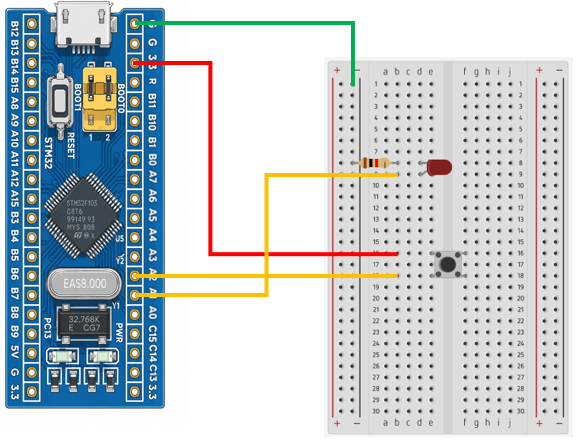

# STM32 Project - Buzzer Toggle LED 2

這是一個基於 STM32F103C8T6 微控制器的示例專案，展示如何使用外部中斷 EXTI 2 控制 LED 的亮滅。

## 硬體要求

* STM32F103C8T6 微控制器 x1
* 按鍵開關 x1
* 220Ω 電阻 ×1
* LED x1
* ST-Link 燒錄器

## 軟體依賴

* VSCode
* EIDE
* Keil MDK ARM Toolchain
* CMSIS Device Header

## 電路圖

## 構建和編譯

1. 使用 VSCode 開啟專案資料夾
2. 確認 EIDE 已設定 Keil MDK-Arm Toolchain
3. 執行 Build
4. 產生 HEX 檔
5. 使用 ST-Link 將程式燒錄至 STM32F103C8T6

## 使用方法

將程式燒錄至 STM32F103C8T6 後，每按下一次按鍵，LED 將切換一次亮滅。

## 功能介紹

* 外部中斷

  使用 EXTI2 偵測 PA2 按鍵輸入，採用上升緣觸發方式

* 中斷處理函式

  ISR 僅負責設定事件旗標，不執行延遲或其他耗時工作，以降低中斷執行時間。

* 按鍵消抖

  主程式收到事件後，進行軟體消抖，再次確認按鍵狀態，避免按鍵彈跳造成誤觸發

* LED 控制

  確認按鍵有效後，切換 LED 的輸出狀態，實現按一下切換一次亮滅（Toggle）