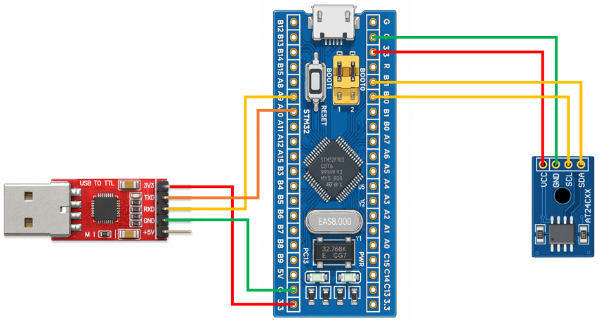

# STM32 Project - I2C EEPROM

這是一個基於 STM32F103C8T6 微控制器的示例專案，透過 USART 接收電腦端傳送的資料，並使用 I2C 通訊協定將資料寫入 AT24C02 EEPROM；同時支援從 EEPROM 讀取資料，並透過 USART 將讀取結果回傳至電腦端，實現完整的資料寫入、儲存與讀取流程。

## 硬體需求

* STM32F103C8T6 微控制器 x1
* ST-Link 燒錄器
* AT24C02 EEPROM ×1
* USB-TTL 模組 (專案使用 CP2102 模組)

## 軟體需求

* VSCode
* EIDE
* Keil MDK ARM Toolchain
* CMSIS Device Header
* 序列埠監控軟體（例如：串口調試助手）

## 電路圖

## 構建和編譯

1. 使用 VSCode 開啟專案資料夾
2. 確認 EIDE 已設定 Keil MDK-Arm Toolchain
3. 執行 Build
4. 產生 HEX 檔
5. 使用 ST-Link 將程式燒錄至 STM32F103C8T6

## 使用方法

將程式燒錄至 STM32F103C8T6，開啟序列埠監控軟體。
設定 UART 參數：
| 參數        | 設定值      |
| --------- | -------- |
| Baud Rate | 9600 bps |
| Data Bits | 8        |
| Parity    | None     |
| Stop Bits | 1        |

在序列埠輸入控制命令：
| 傳送命令  | 功能     |
| ----- | ------ |
| `Read:<int>`  | 讀取指定長度的資料 |
| `Write:<string>` | 寫入資料 |

## 功能介紹

* USART 資料接收

    透過 USART 接收電腦端傳送的資料

* EEPROM 資料寫入

    將 USART 接收到的資料透過 I2C 寫入 AT24C02 EEPROM

* EEPROM 資料讀取

    透過 I2C 從 AT24C02 EEPROM 讀取已儲存的資料

* USART 資料回傳

  將 EEPROM 讀取的資料透過 USART 傳送至電腦端，方便確認寫入與讀取結果

* I2C 通訊控制

  實作 Start、Stop、ACK、NACK、位址傳送及資料收發等基本 I2C 操作
