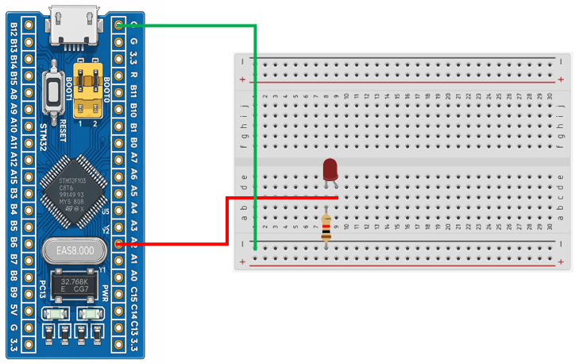

# STM32 Project - LED Blink 2

這是一個基於 STM32F103C8T6 微控制器的示例專案，展示如何使用 SysTick Timer 的方式控制 LED 閃爍。

## 硬體要求

* STM32F103C8T6 微控制器
* LED x1
* 220Ω 電阻 x1
* ST-Link 燒錄器

## 軟體依賴

* VSCode
* EIDE
* Keil MDK ARM Toolchain
* CMSIS Device Header

## 電路圖

## 構建和編譯

1. 使用 VSCode 開啟專案資料夾
2. 確認 EIDE 已設定 Keil MDK-Arm Toolchain
3. 執行 Build
4. 產生 HEX 檔
5. 使用 ST-Link 將程式燒錄至 STM32F103C8T6

## 使用方法

將程式燒錄至 STM32F103C8T6 後，LED 將每隔約 0.1 秒切換一次狀態（亮／滅），並持續循環閃爍。

## 功能介紹

* SysTick Timer 時間基準

    使用 SysTick Timer 產生固定的系統時間基準，提供延遲函式所需的計時功能

* LED 延遲控制

    透過延遲函式設定 LED 的亮滅時間，實現固定週期的 LED 閃爍效果

