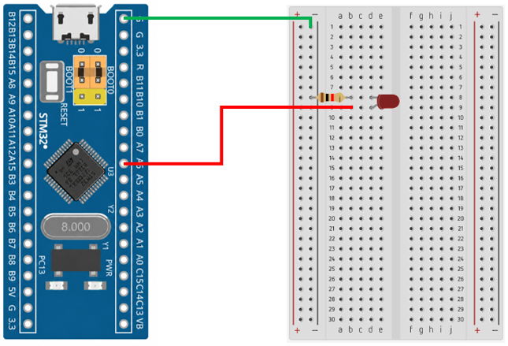

# STM32 Project - Breathing LED

這是一個基於 STM32F103C8T6 微控制器的示例專案，展示如何使用 Timer PWM 控制 LED 亮度，使 LED 呈現漸亮、漸暗的呼吸燈效果。

## 硬體要求

* STM32F103C8T6 微控制器
* LED x1
* 220Ω 電阻 x1
* ST-Link 燒錄器

## 軟體依賴

* VSCode
* EIDE
* Keil MDK ARM Toolchain
* CMSIS Device Header

## 電路圖

## 構建和編譯

1. 使用 VSCode 開啟專案資料夾
2. 確認 EIDE 已設定 Keil MDK-Arm Toolchain
3. 執行 Build
4. 產生 HEX 檔
5. 使用 ST-Link 將程式燒錄至 STM32F103C8T6

## 使用方法

將程式燒錄至 STM32F103C8T6 後，Timer 將持續產生 PWM 訊號，程式透過週期性調整 PWM 的占空比，使 LED 逐漸變亮，再逐漸變暗，形成持續循環的呼吸燈效果。

## 功能介紹

* Timer PWM 輸出

    使用 Timer 的 PWM 功能產生固定頻率的 PWM 訊號，並透過 Timer Channel 輸出至 LED

* PWM Duty Cycle 控制

    透過修改 CCR 的值改變 PWM Duty Cycle，進而控制 LED 的亮度

