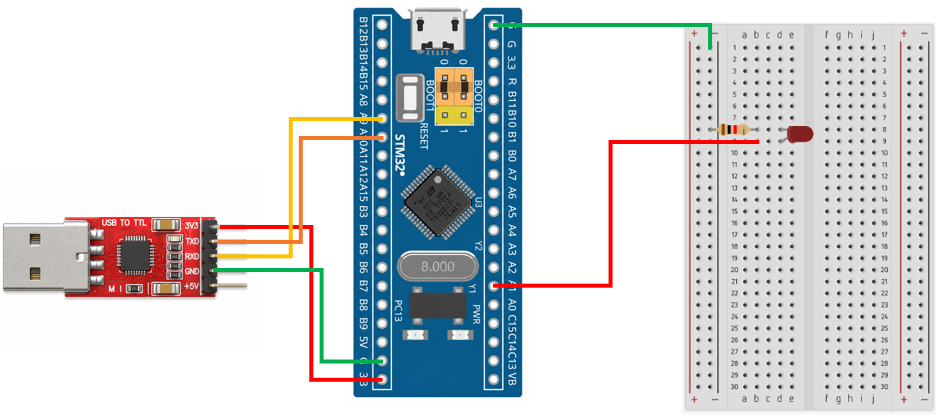

# STM32 Project - UART And LED

這是一個基於 STM32F103C8T6 微控制器的示例專案，展示如何使用 UART 接收電腦傳送的命令，並控制 LED 的開啟與關閉
UART TX 與 RX 均使用 DMA 進行資料傳輸，以減少 CPU 在 UART 資料收發過程中的負擔。

## 硬體需求

* STM32F103C8T6 微控制器 x1
* LED ×1
* 220Ω 電阻 ×1
* ST-Link 燒錄器
* USB-TTL 模組 (專案使用 CP2102 模組)

## 軟體需求

* VSCode
* EIDE
* Keil MDK ARM Toolchain
* CMSIS Device Header
* 序列埠監控軟體（例如：串口調試助手）

## 電路圖

## 構建和編譯

1. 使用 VSCode 開啟專案資料夾
2. 確認 EIDE 已設定 Keil MDK-Arm Toolchain
3. 執行 Build
4. 產生 HEX 檔
5. 使用 ST-Link 將程式燒錄至 STM32F103C8T6

## 使用方法

將程式燒錄至 STM32F103C8T6，開啟序列埠監控軟體。
設定 UART 參數：
| 參數        | 設定值      |
| --------- | -------- |
| Baud Rate | 9600 bps |
| Data Bits | 8        |
| Parity    | None     |
| Stop Bits | 1        |

在序列埠輸入控制命令：
| 傳送命令  | 功能     |
| ----- | ------ |
| `on`  | 開啟 LED |
| `off` | 關閉 LED |
| `toggle` | 切換 LED |

## 功能介紹

* UART TX/RX DMA

    UART 資料傳送和接收都使用 DMA

* UART 接收中斷

    當 UART 接收到空閒訊號時進入中斷服務程式，讀取接收到的字元並進行命令解析

* 命令解析

    接收命令後，比對字串內容，控制 LED