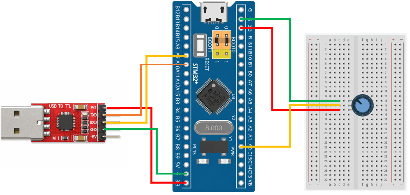

# STM32 Project - ADC

這是一個基於 STM32F103C8T6 微控制器的示例專案，展示如何使用電位器產生類比電壓，
透過 ADC 進行電壓取樣，並使用 UART 傳送至電腦

## 硬體需求

* STM32F103C8T6 微控制器 x1
* 電位器 ×1
* ST-Link 燒錄器
* USB-TTL 模組 (專案使用 CP2102 模組)

## 軟體需求

* VSCode
* EIDE
* Keil MDK ARM Toolchain
* CMSIS Device Header
* 序列埠監控軟體（例如：串口調試助手）

## 電路圖

## 構建和編譯

1. 使用 VSCode 開啟專案資料夾
2. 確認 EIDE 已設定 Keil MDK-Arm Toolchain
3. 執行 Build
4. 產生 HEX 檔
5. 使用 ST-Link 將程式燒錄至 STM32F103C8T6

## 使用方法

將程式燒錄至 STM32F103C8T6，開啟序列埠監控軟體。
設定 UART 參數：
| 參數        | 設定值      |
| --------- | -------- |
| Baud Rate | 9600 bps |
| Data Bits | 8        |
| Parity    | None     |
| Stop Bits | 1        |

旋轉電位器改變輸入電壓。ADC 會讀取輸入電壓並產生 12-bit ADC 數值，
再將 ADC 換算後的電壓透過 UART 傳送至電腦。

電壓換算公式為：
$$
V_{IN} = \frac{ADC_{DR}}{4095} \times V_{REF}
$$

## 功能介紹

* ADC 類比數位轉換

    使用 STM32 內建的 12-bit ADC，將類比電壓轉換為 0 ~ 4095 的數位值

* ADC 電壓換算

    讀取 ADC_DR 的轉換結果，並根據實際參考電壓將 ADC 數值換算成輸入電壓

* UART 資料輸出

    將 ADC 換算後的電壓透過 UART 傳送至電腦，方便觀察量測結果
