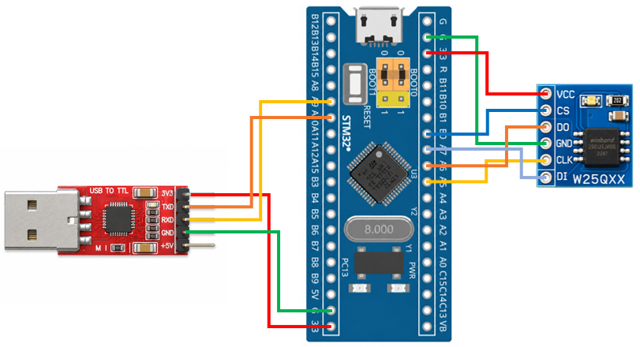

# STM32 Project - SPI W25Q32

這是一個基於 STM32F103C8T6 微控制器的示例專案，展示如何使用 SPI 通訊協定將資料寫入 W25Q32 Flash Memory

## 硬體需求

* STM32F103C8T6 微控制器 x1
* W25Q32 Flash Memory ×1
* ST-Link 燒錄器
* USB-TTL 模組 (專案使用 CP2102 模組)

## 軟體需求

* VSCode
* EIDE
* Keil MDK ARM Toolchain
* CMSIS Device Header
* 序列埠監控軟體（例如：串口調試助手）

## 電路圖

## 構建和編譯

1. 使用 VSCode 開啟專案資料夾
2. 確認 EIDE 已設定 Keil MDK-Arm Toolchain
3. 執行 Build
4. 產生 HEX 檔
5. 使用 ST-Link 將程式燒錄至 STM32F103C8T6

## 使用方法

將程式燒錄至 STM32F103C8T6，開啟序列埠監控軟體。
設定 UART 參數：
| 參數        | 設定值      |
| --------- | -------- |
| Baud Rate | 9600 bps |
| Data Bits | 8        |
| Parity    | None     |
| Stop Bits | 1        |

在序列埠輸入控制命令：
| 傳送命令  | 功能     |
| ----- | ------ |
| `Read:<int>`  | 讀取指定長度的資料 |
| `Write:<string>` | 寫入資料 |

## 功能介紹

* USART 資料收發

    透過 USART 接收電腦端傳送的資料，並將從 W25Q32 讀取的資料透過 USART 回傳至電腦端

* Flash 資料讀寫

    透過 SPI 將 USART 接收到的資料寫入 W25Q32 Flash Memory，並支援從 W25Q32 讀取已儲存的資料

* SPI 通訊控制

    實作 CS 控制、SPI 指令傳送及資料收發等基本 SPI 操作，完成 STM32F103C8T6 與 W25Q32 之間的通訊

* W25Q32 Flash 控制

    實作 W25Q32 基本操作，包括 Write Enable、Page Program、Read Data、Sector Erase 及 Status Register 讀取等功能