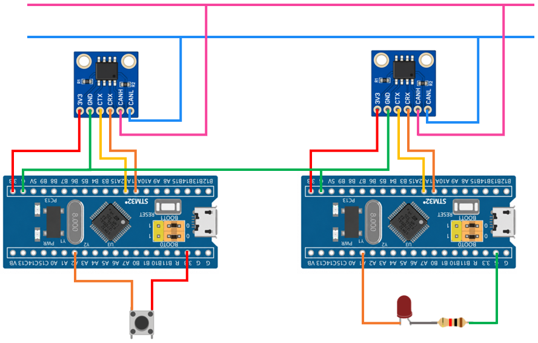

# STM32 Project - CAN And LED

這是一個基於 STM32F103C8T6 微控制器的示例專案，，展示如何使用 CAN 通訊協定在兩個 STM32 節點之間進行資料傳輸

## 硬體需求

* STM32F103C8T6 微控制器 x2
* CAN Transceiver 模組 ×2
* ST-Link 燒錄器
* 按鈕 ×1
* LED ×1
* LED 限流電阻 ×1

## 軟體需求

* VSCode
* EIDE
* Keil MDK ARM Toolchain
* CMSIS Device Header

## 電路圖

## 構建和編譯

1. 使用 VSCode 開啟專案資料夾
2. 確認 EIDE 已設定 Keil MDK-Arm Toolchain
3. 執行 Build
4. 產生 HEX 檔
5. 使用 ST-Link 將程式燒錄至 STM32F103C8T6

## 使用方法

將程式燒錄至 STM32F103C8T6，開啟序列埠監控軟體。其中一個 STM32 作為 CAN 資料傳送端，另一個 STM32 作為 CAN 資料接收端。按下傳送端的按鈕後，STM32 透過 CAN Bus 傳送資料。接收端 STM32 接收到指定的 CAN Message 後，控制 LED 的狀態。

## 功能介紹

* CAN 資料傳送

    透過 STM32 的 CAN 控制器建立 CAN Message，並透過 CAN Transceiver 將資料傳送至 CAN Bus

* CAN 資料接收

    接收來自 CAN Bus 的 CAN Message，並取得 Data Field，根據接收到的資料執行對應操作

* 按鈕控制

    使用 GPIO 讀取按鈕狀態。按下按鈕後，由傳送端 STM32 發送指定的 CAN Message

* LED 控制

    接收端 STM32 根據接收到的 CAN Message 控制 LED，例如切換 LED 的亮滅狀態