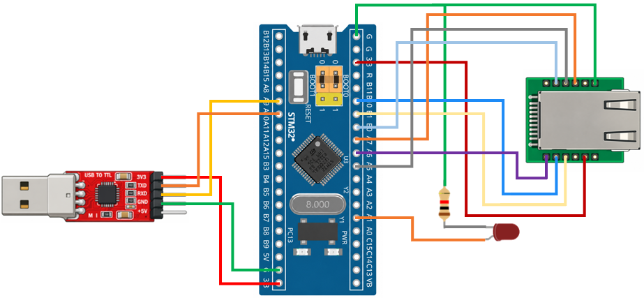

# STM32 Project - W5500

這是一個基於 STM32F103C8T6 微控制器與 W5500 Ethernet 模組的示例專案，展示如何透過 Ethernet 建立 TCP/IP 網路通訊，並使用 Web 網頁遠端控制 STM32 上的 LED

## 硬體需求

* STM32F103C8T6 微控制器 x2
* W5500 Ethernet 模組 ×1
* ST-Link 燒錄器 ×1
* LED ×1
* 220Ω 電阻 ×1
* Ethernet 網路線 ×1

## 軟體需求

* VSCode
* EIDE
* Keil MDK ARM Toolchain
* CMSIS Device Header
* Python
* FastAPI
* Uvicorn

## 電路圖



## 構建和編譯

1. 使用 VSCode 開啟專案資料夾
2. 確認 EIDE 已設定 Keil MDK-Arm Toolchain
3. 執行 Build
4. 產生 HEX 檔
5. 使用 ST-Link 將程式燒錄至 STM32F103C8T6
6. 程式預設將 W5500 的 IPv4 位址為 `192.168.1.100`，Subnet Mask 為 `255.255.255.0`
7. 設定電腦端 Ethernet 網路介面，IPv4 位址設為 `192.168.1.10`，Subnet Mask 設為 `255.255.255.0`，確保與 W5500 位於相同網段
8. 進入 API 資料夾，在終端機中執行程式，用來安裝套件 (需要先安裝 uv)
    ```shell
        uv sync
    ```
9. 啟動 FastAPI Server，其中 Port `8080` 作為 Web Server，Port `5000` 作為 TCP Server
    ```shell
        uv run uvicorn main:app --reload --host 0.0.0.0 --port 8080
    ```
10. 使用瀏覽器開啟 `http://127.0.0.1:8080`，進入 Web 控制頁面並操作 STM32

## 使用方法

將程式燒錄至 STM32F103C8T6，W5500 初始化完成後，主動與電腦端建立連線並維持 TCP 長連線。進入 Web 控制頁面，使用者可以控制 LED。FastAPI 接收到 Web 操作後，透過 TCP 長連線將命令傳送至 W5500。STM32 取得接收到的資料後，根據命令控制 LED 開啟或關閉

`Browser → FastAPI → TCP Server → W5500 → STM32 → LED`

## 功能介紹

* W5500 Ethernet 通訊

    STM32 透過 SPI 介面控制 W5500，使用 W5500 的硬體 TCP/IP 功能進行 Ethernet 網路通訊

* TCP 長連線

    W5500 與電腦端 TCP Server 保持 TCP Connection，使 Web Server 可以隨時將控制命令傳送至 STM32

* FastAPI Web Server

    電腦端使用 FastAPI 建立 Web Server，提供 Web 控制介面與 API，同時與 W5500 保持連線

* LED 控制

    STM32 接收到 W5500 傳來的 TCP 資料後解析控制命令，並透過 GPIO 控制 LED