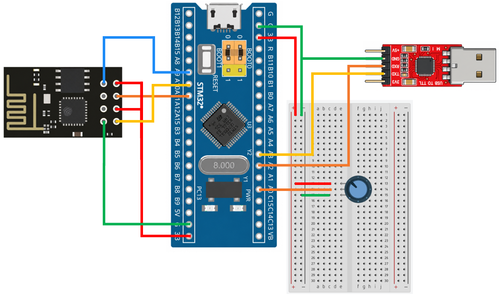

# STM32 Project - ESP8266

這是一個基於 STM32F103C8T6 微控制器的示例專案，展示如何透過 ESP8266 建立 TCP 網路通訊，並使用 Web 網頁監測電位器電壓

## 硬體需求

* STM32F103C8T6 微控制器 x2
* ESP8266 模組 ×1
* ST-Link 燒錄器 ×1
* 電位器 ×1

## 軟體需求

* VSCode
* EIDE
* Keil MDK ARM Toolchain
* CMSIS Device Header
* Python
* FastAPI
* Uvicorn

## 電路圖



## 構建和編譯

1. 使用 VSCode 開啟專案資料夾
2. 確認 EIDE 已設定 Keil MDK-Arm Toolchain
3. 執行 Build
4. 產生 HEX 檔
5. 使用 ST-Link 將程式燒錄至 STM32F103C8T6
6. 修改程式中的 SSID 和 Wifi 密碼，將 ESP8266 連線至 Wi-Fi
7. 查看電腦的 ip 位址，並修改程式中的 url
8. 進入 API 資料夾，在終端機中執行程式，用來安裝套件 (需要先安裝 uv)
    ```shell
        uv sync
    ```
9. 啟動 FastAPI Server，其中 Port `8080` 作為 Web Server
    ```shell
        uv run uvicorn main:app --reload --host 0.0.0.0 --port 8080
    ```
10. 使用瀏覽器開啟 `http://127.0.0.1:8080`，進入 Web 控制頁面監測電位器電壓

## 使用方法

將程式燒錄至 STM32，並連接電位器。ESP8266 連線至 Wi-Fi 後，每 0.5 秒讀取一次電位器電壓，透過 HTTP POST 傳送至 FastAPI。FastAPI 接收電壓後，儲存最新的電壓，並提供 API 讓瀏覽器取得資料。
使用者開啟網頁後，JavaScript 每秒會取得最新電壓資料，並繪製成即時折線圖，使用者可以旋轉電位器查看電壓的變化。

## 功能介紹

* Wi-Fi 網路通訊

    ESP8266 連線至 Wi-Fi，透過 TCP 與 FastAPI 進行通訊

* FastAPI Server

    負責接收 ESP8266 傳送的電壓資料，並提供 Web Server、HTML 頁面及 REST API

* ADC 電壓讀取

    使用 ADC 讀取電位器輸出的類比訊號，並將 ADC 數值轉換成電壓

* 即時折線圖

    網頁使用 Plotly.js 繪製折線圖，每秒加入最新的電壓資料，即時顯示電位器電壓的變化